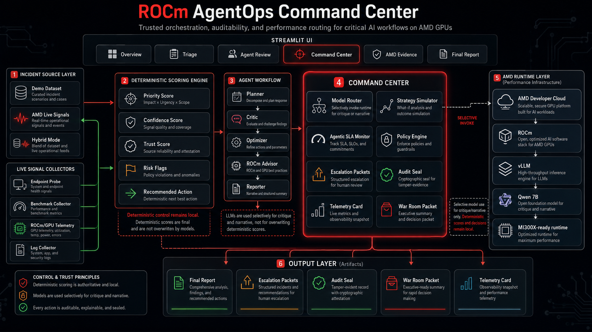
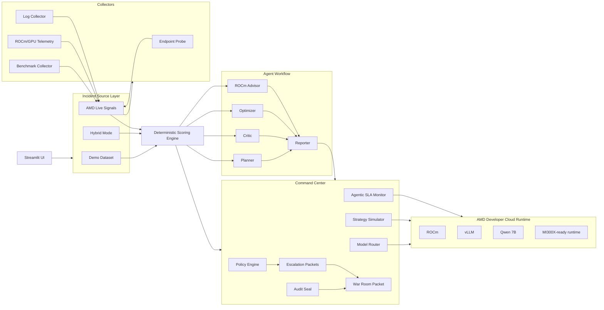
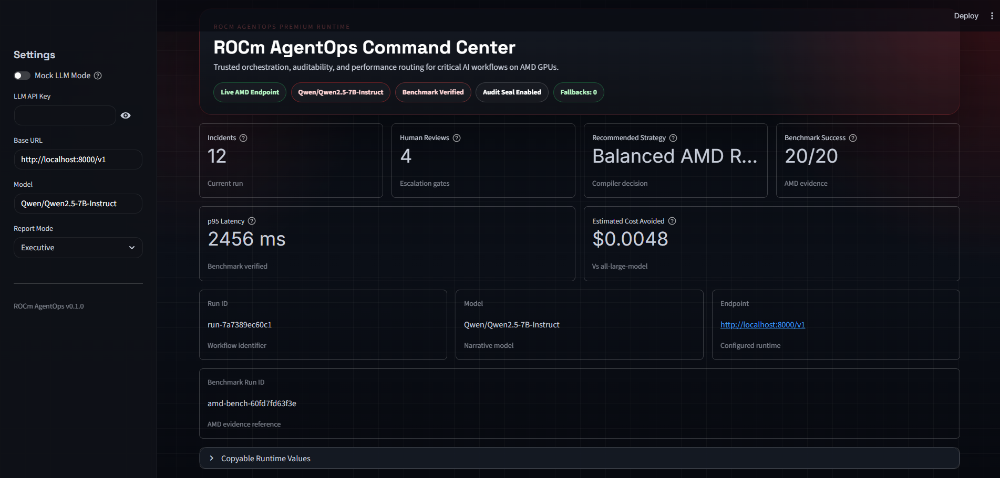
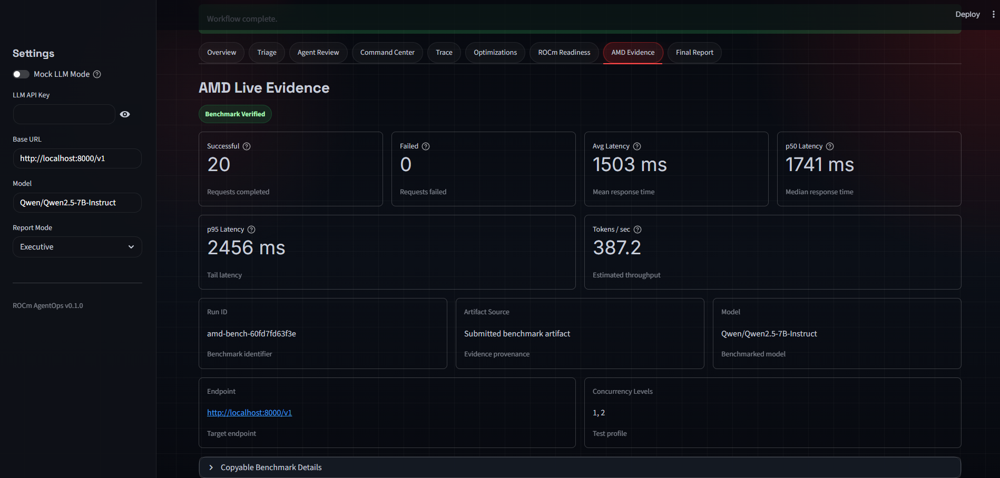
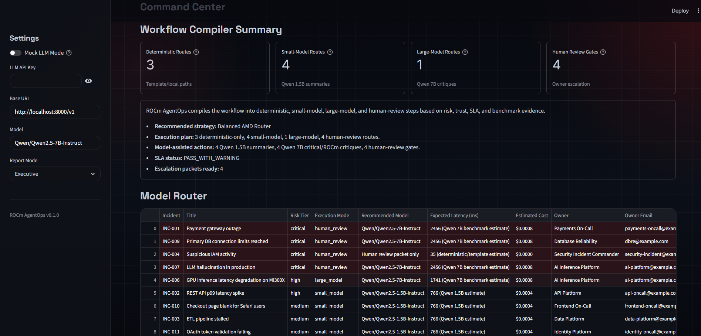
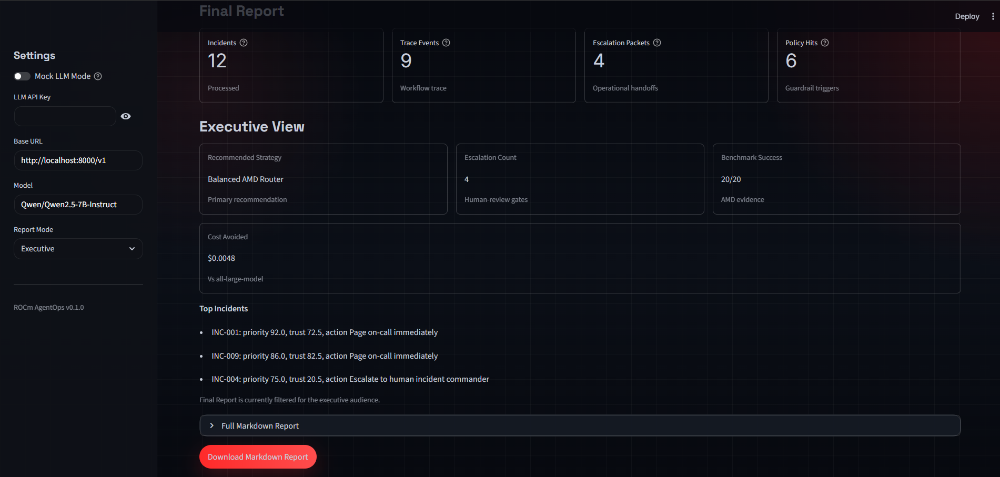

# ROCm AgentOps Command Center

An AgentOps command center that scores, routes, audits, and optimizes critical AI workflows on AMD GPUs.




## Product Overview

ROCm AgentOps is a workflow compiler for agentic operations. It ingests incidents from a business incident template set, live AMD workload signals, or both, then applies deterministic scoring before any advisory model narrative is used. The platform computes priority, confidence, trust, and risk flags locally, compares its decisions against a simpler baseline, and compiles each incident into the right execution path: deterministic only, smaller-model summary, Qwen 7B critique, or human review. Command Center components add policy guardrails, strategy simulation, SLA monitoring, escalation packets, audit sealing, and War Room Packet export. AMD/vLLM benchmark evidence is treated as routing input rather than decorative telemetry. The result is an audit-ready workflow assurance report instead of a chatbot transcript.

## Why It Matters

AI agents are easy to prototype and difficult to trust in production. Teams need auditability, latency visibility, cost control, routing discipline, and explicit human review boundaries when workflows touch payments, security, inference quality, or customer operations. Blindly sending every task to a large model is slower, more expensive, and harder to govern. ROCm AgentOps addresses that gap by separating deterministic operational control from advisory LLM narrative and by using AMD-backed benchmark evidence to decide when deeper inference is justified.

## What ROCm AgentOps Does

| Capability | What it does | Why it matters |
|---|---|---|
| Deterministic scoring | Computes priority, confidence, trust, and recommended action locally | Keeps core workflow control auditable |
| Trust score | Quantifies when autonomous action is unsafe | Forces low-trust cases into review |
| Risk flags | Detects hallucination risk, security gaps, missing evidence, and inference degradation | Makes failure modes explicit |
| Baseline vs AgentOps | Compares naive ranking to policy-aware routing | Shows where AgentOps adds operational value |
| Model Router | Selects deterministic, smaller-model, Qwen 7B, or human-review paths | Preserves latency and cost budgets |
| What-if Strategy Simulator | Compares speed, cost, quality, safety, and balanced strategies | Supports operator tradeoff decisions |
| Agentic SLA Monitor | Evaluates benchmark health, trust thresholds, and fallback behavior | Prevents unsafe runtime assumptions |
| Policy-as-Code Guardrails | Applies rule-based routing and escalation constraints | Encodes policy explicitly |
| AMD Live Signals | Generates incidents from endpoint health, benchmark evidence, logs, and telemetry | Connects workflow assurance to runtime signals |
| ROCm/GPU telemetry | Reads optional AMD runtime signal captures | Adds hardware context to inference incidents |
| Owner-aware Escalation Packets | Produces operator-ready markdown and `.eml` handoff packets | Bridges workflow output to human ownership |
| Audit Seal | Seals each run with SHA-256 over operational artifacts | Makes post-run tampering visible |
| War Room Packet | Exports the full operational handoff bundle | Supports incident reviews and audit trails |
| Telemetry Card | Generates a concise build-in-public benchmark summary | Makes evidence sharing simple and consistent |
| Final Report | Produces an operator-facing workflow assurance report | Consolidates scoring, routing, and escalation |

## Live AMD Evidence

ROCm AgentOps was validated against a real `Qwen/Qwen2.5-7B-Instruct` model served through an OpenAI-compatible vLLM endpoint on AMD-backed infrastructure. The submitted benchmark recorded:

- Successful requests: `20/20`
- p50 latency: `1740.98 ms`
- p95 latency: `2456.03 ms`
- Estimated tokens/sec: `387.17`

Deterministic scoring remains local. Narrative, critique, and routing-aware model assistance can run on AMD/vLLM when the workflow needs deeper reasoning. Benchmark numbers are point-in-time measurements from the submitted run and should be refreshed after endpoint, model, workload, or hardware changes.

## Architecture



See [docs/architecture.md](docs/architecture.md) for the expanded architecture walkthrough.

## Workflow

1. Ingest incidents from the demo dataset, AMD Live Signals, or Hybrid mode.
2. Score incidents deterministically.
3. Detect risk flags and trust gaps.
4. Compare baseline vs AgentOps.
5. Route work through deterministic, smaller-model, Qwen 7B, or human review.
6. Generate escalation packets.
7. Seal the run with a SHA-256 audit seal.
8. Export a War Room Packet.

## Model Router

The Model Router is intentionally conservative:

- low risk incidents stay on deterministic-only execution
- medium and some high-risk incidents can use smaller-model summaries
- critical, low-trust, hallucination-risk, or security-sensitive incidents can escalate to Qwen 7B plus human review
- deterministic scores are never overwritten by LLM output

This keeps Qwen 7B focused on the cases where additional reasoning quality is worth the latency and cost.

## AMD Live Signals

Live incidents are generated from workload evidence captured from AMD-backed inference infrastructure. The live intake path can evaluate:

- endpoint probe health
- benchmark availability and SLA breaches
- ROCm/GPU telemetry from `amd_runtime_signals.json`
- local log findings
- incident generation from p95 latency, failed requests, endpoint availability, and GPU memory pressure

These are not internal AMD incidents. They are operational incidents inferred from runtime evidence collected around an AMD-hosted inference stack.

## Policy-as-Code

Operational policy lives in `data/policies.json`. Example rules include:

- security incidents with missing evidence must route to human review
- hallucination risk must route to human review
- p95 latency must stay within the configured SLA threshold
- autonomous action requires a minimum trust threshold

The policy engine records which rules were loaded, which ones triggered, and how they influenced routing or escalation.

## Quickstart

```bash
python -m venv venv
```

Windows PowerShell:

```powershell
venv\Scripts\Activate.ps1
pip install -r requirements.txt
streamlit run app.py
```

macOS / Linux:

```bash
source venv/bin/activate
pip install -r requirements.txt
streamlit run app.py
```

The default public-safe mode uses mock narrative generation, the demo dataset, and example benchmark evidence when available. That keeps the app usable without a live endpoint while preserving the full Command Center flow.

## Running Locally

The Quickstart section above is the recommended local path. For environment variables, start from `.env.example` and keep mock mode enabled until a real endpoint is available.

## Runtime Modes

- `Mock mode`: deterministic scoring stays active while LLM narrative falls back to mock responses.
- `Real endpoint mode`: planner, critic, optimizer, ROCm advisor, and report narrative can call a live OpenAI-compatible endpoint.
- `Fallback behavior`: if the live endpoint fails, deterministic scoring still completes and narrative surfaces can fall back safely.
- `Empty API key`: supported for local vLLM endpoints that do not require authentication.
- `Deterministic scoring`: unchanged across all runtime modes.

## Connecting to AMD/vLLM

1. Start an OpenAI-compatible vLLM endpoint on your AMD Developer Cloud environment.
2. Forward the port locally through SSH if needed.
3. Set the endpoint and model in the sidebar or `.env`.
4. Disable Mock Mode when the endpoint is healthy.

Example runtime values:

- Base URL: `http://localhost:8000/v1`
- Model: `Qwen/Qwen2.5-7B-Instruct`

Example SSH tunnel:

```bash
ssh -L 8000:127.0.0.1:8000 USER@YOUR_HOST
```

## Benchmarking

Use the built-in benchmark tooling to validate endpoint health and refresh evidence.

```bash
python scripts/health_check_endpoint.py --base-url "http://localhost:8000/v1"
python scripts/run_amd_benchmark.py --base-url "http://localhost:8000/v1" --model "Qwen/Qwen2.5-7B-Instruct" --concurrency 1 2 --repeat 2 --output "data/amd_benchmark_results.json"
python scripts/generate_evidence_pack.py --input "data/amd_benchmark_results.json" --output "reports/amd_evidence_pack.md"
```

The repository includes `data/amd_benchmark_results.example.json` as a public example artifact. Replace the local benchmark file with your own run when refreshing evidence.

## Capturing ROCm/GPU Telemetry

Run this on the AMD instance or inside the ROCm container:

```bash
python scripts/collect_amd_runtime_signals.py --output amd_runtime_signals.json
```

Copy the resulting file into the repository working directory:

```bash
scp root@YOUR_HOST:/root/amd_runtime_signals.json data/amd_runtime_signals.json
```

## Deploying on Hugging Face Spaces

1. Create a new Hugging Face Space.
2. Select the Docker SDK.
3. Push this repository to the Space.
4. Hugging Face reads the YAML front matter at the top of this README.
5. The container runs Streamlit on port `8501`.
6. Add secrets only if you want to connect the public Space to a real endpoint.

Optional Space secrets:

```text
USE_MOCK_LLM=false
LLM_BASE_URL=https://YOUR_PUBLIC_AMD_VLLM_ENDPOINT/v1
LLM_MODEL=Qwen/Qwen2.5-7B-Instruct
LLM_API_KEY=
```

Important notes:

- localhost endpoints do not work from Hugging Face Spaces unless the endpoint is running inside the same container
- for AMD Developer Cloud, use a public endpoint, VPN/proxy, or run the live benchmark locally and upload artifacts
- for public previews, mock mode and example evidence are acceptable as long as they are clearly labeled

See [docs/deployment.md](docs/deployment.md) for the full deployment guide.

## War Room Packet

Each workflow run can export a downloadable War Room Packet that includes:

- `final_report.md`
- `audit_seal.json`
- `telemetry_card.md`
- `amd_benchmark_results.json`
- `model_router.csv`
- `strategy_comparison.csv`
- `escalation_packets/`

## Screenshots

Placeholder asset paths:

- `docs/assets/architecture.png`
- `docs/screenshots/overview.png`
- `docs/screenshots/amd-live-evidence.png`
- `docs/screenshots/command-center.png`
- `docs/screenshots/final-report.png`






## Repository Structure

```text
rocm-agentops/
|-- app.py
|-- README.md
|-- Dockerfile
|-- requirements.txt
|-- .env.example
|-- agents/
|-- core/
|-- data/
|   |-- amd_benchmark_results.example.json
|   |-- owners.json
|   |-- policies.json
|   `-- sample_incidents.json
|-- docs/
|   |-- architecture.md
|   |-- deployment.md
|   |-- build_in_public.md
|   |-- IMAGE_PROMPT_ARCHITECTURE.md
|   |-- assets/
|   `-- screenshots/
|-- live/
|-- reports/
|-- scripts/
|-- ui/
`-- workflows/
```

## Security and Privacy

- no secrets should be committed to the repository
- API keys should be provided through environment variables, Streamlit secrets, or the sidebar at runtime
- escalation packets are generated but not sent
- the audit seal is a tamper-evident hash, not a blockchain system
- production deployment should add authentication, authorization, and access control around runtime operations

## Limitations

- this is a pre-production implementation
- deterministic heuristics should be calibrated to each organization's incident taxonomy
- benchmark results are point-in-time and should be refreshed after infrastructure changes
- cost values remain estimated unless provider billing or metering is integrated
- ROCm telemetry coverage depends on the available AMD tooling and exported signal files
- production deployment should add persistent storage, authentication, and alerting integrations

## Roadmap

- persistent trace storage
- PagerDuty, Jira, and Slack connectors
- Prometheus and Grafana integration
- automated policy tuning
- historical routing analytics
- multi-workflow templates
- model cost and quality benchmarking
- Qwen, Llama, and Mistral routing comparisons
- enterprise authentication and RBAC

## License

MIT
