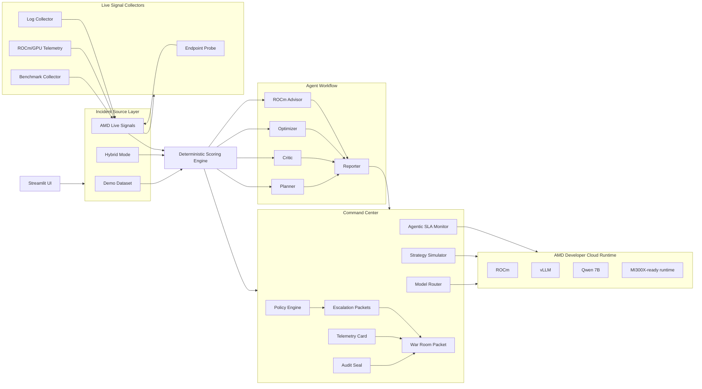

# ROCm AgentOps Architecture

## Overview

ROCm AgentOps is an operational control layer for AI workflows. It ingests incidents from a business template dataset, live AMD workload evidence, or both, then applies deterministic scoring before any advisory model narrative is used. Benchmark evidence, trust thresholds, and policy guardrails are all first-class inputs into routing, escalation, and reporting. The architecture is designed so that deterministic control remains local while higher-cost reasoning is selectively delegated to models served through AMD/vLLM.

## System Diagram

## Data Flow

1. Incidents enter from the demo dataset, AMD Live Signals, or Hybrid mode.
2. Live signal collectors gather endpoint probe results, benchmark artifacts, telemetry files, and optional log findings.
3. The deterministic scoring engine computes priority, confidence, trust, recommended action, and risk flags.
4. The workflow compares deterministic decisions against a simpler baseline to surface ranking mismatches.
5. Planner, critic, optimizer, ROCm advisor, and reporter contribute advisory narrative only.
6. The Command Center evaluates route selection, what-if strategies, policy hits, SLA status, escalation requirements, and audit metadata.
7. War Room Packet assembly exports the final report and operational handoff artifacts.

## Runtime Modes

### Mock Mode

- Deterministic scoring remains fully active.
- Advisory model outputs can fall back to mock responses.
- Useful for local development and runtime resilience when a live endpoint is unavailable.

### Real Endpoint Mode

- Advisory narrative can call an OpenAI-compatible endpoint.
- Empty API keys are supported for local vLLM endpoints without auth.
- Deterministic control logic remains unchanged.

### Fallback Behavior

- If live model calls fail, deterministic scoring still completes.
- Runtime state, errors, and fallback count are surfaced in the UI and final report.

## AMD/vLLM Integration

ROCm AgentOps can point its advisory model steps to an OpenAI-compatible endpoint served by vLLM on AMD-backed infrastructure. The submitted benchmark used `Qwen/Qwen2.5-7B-Instruct` and verified live inference behavior with:

- `20/20` successful requests
- `1740.98 ms` p50 latency
- `2456.03 ms` p95 latency
- `387.17` estimated tokens/sec

These metrics are treated as operational evidence, not decorative telemetry. They influence routing estimates, SLA status, and command center strategy recommendations.

## Live Incident Generation

AMD Live Signals can create incidents from:

- endpoint availability or probe failure
- benchmark p95 latency breaches
- benchmark failure counts or reliability drops
- GPU memory pressure from `amd_runtime_signals.json`
- optional local log findings

Live incidents are generated from workload evidence captured from AMD-backed inference infrastructure. They are not presented as internal AMD incidents.

## Command Center Components

### Model Router

Compiles each incident into:

- deterministic only
- smaller-model summary
- Qwen 7B critique
- human review

### Strategy Simulator

Compares speed, cost, quality, safety, and balanced routing profiles without calling the live endpoint.

### Agentic SLA Monitor

Evaluates benchmark health, trust thresholds, and runtime fallbacks against operator guardrails.

### Policy Engine

Loads rules from `data/policies.json` and records which ones influenced routing or escalation.

### Escalation Packets

Generates owner-aware markdown and `.eml` handoff packets without sending real email.

### Audit Seal

Generates a SHA-256 hash over the run payload to make post-run tampering visible. It is a tamper-evident audit mechanism, not a blockchain.

### War Room Packet

Packages the final report, audit seal, telemetry card, benchmark artifact, model router CSV, strategy comparison CSV, and escalation packets into one operational handoff bundle.

## Deterministic vs LLM Boundary

Deterministic logic owns:

- priority score
- confidence score
- trust score
- risk flags
- recommended action
- human review requirements

LLMs support:

- planning narrative
- critique wording
- optimization rationale
- ROCm advisory narrative
- operator-facing report phrasing

This boundary is central to the platform’s auditability and runtime control model.
